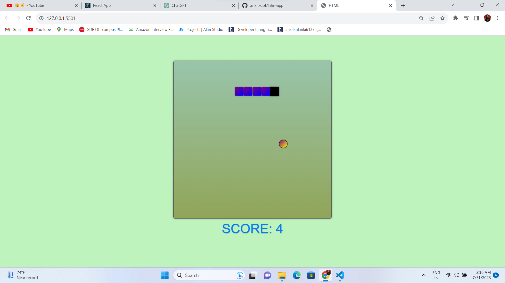

# Snake Game

Welcome to the Snake Game, a classic arcade game built using JavaScript.

## Table of Contents

- [Introduction](#introduction)
- [Demo](#demo)
- [How to Play](#how-to-play)
- [Technologies](#technologies)
- [Contributing](#contributing)
- [License](#license)

## Introduction

The Snake Game is a simple yet addictive game where the player controls a snake that moves around the screen. The objective is to eat the food that appears randomly on the screen to grow longer. As the snake grows, the game becomes more challenging as the player must avoid colliding with the snake's body or the game boundaries.

## Demo

[Click here to play the Snake Game](https://www.example.com/snake-game)

## How to Play

1. Use the arrow keys (up, down, left, right) to control the snake's direction.
2. The snake will move continuously in the direction you choose.
3. Your goal is to eat the food (shown as a dot) that appears randomly on the screen.
4. Each time the snake eats food, it will grow longer.
5. Avoid running into the snake's body or the boundaries of the game screen, as this will end the game.
6. The game will keep track of your score, which increases each time the snake eats food.
7. Try to achieve the highest score possible and challenge your friends to beat it!

## Technologies

The Snake Game is built using the following technologies:

- HTML5 - For the game canvas and structure
- CSS3 - For styling and layout
- JavaScript - For game logic and interactivity
